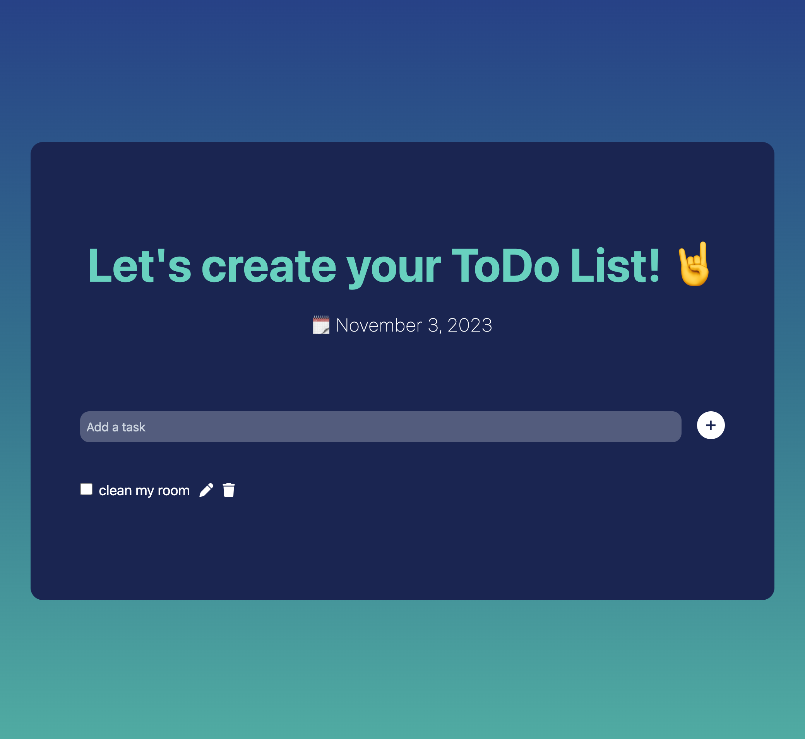

# ToDoList Application

The goal of this project was to create a ToDo Web Application using Node.js, Express.js, and EJS.

To train my skills I've used Tailwind CSS for styling.

This project was created during [The Complete Web Development Bootcamp](https://www.udemy.com/course/the-complete-web-development-bootcamp/) to practice using Node.js, Express.js, EJS and Tailwind CSS.
